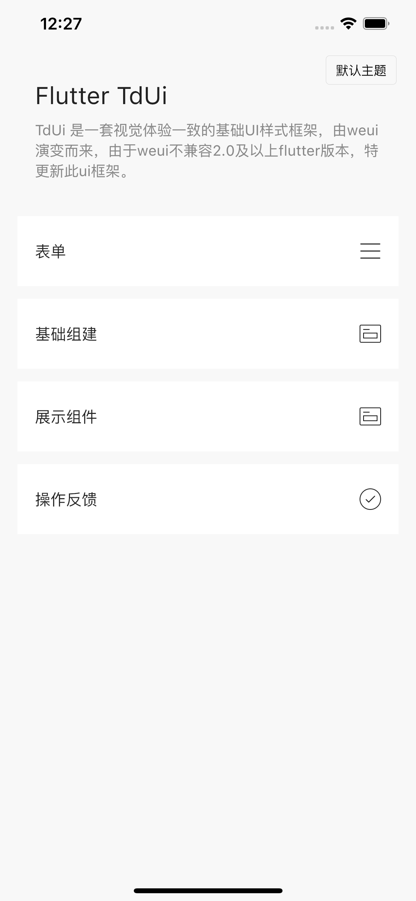
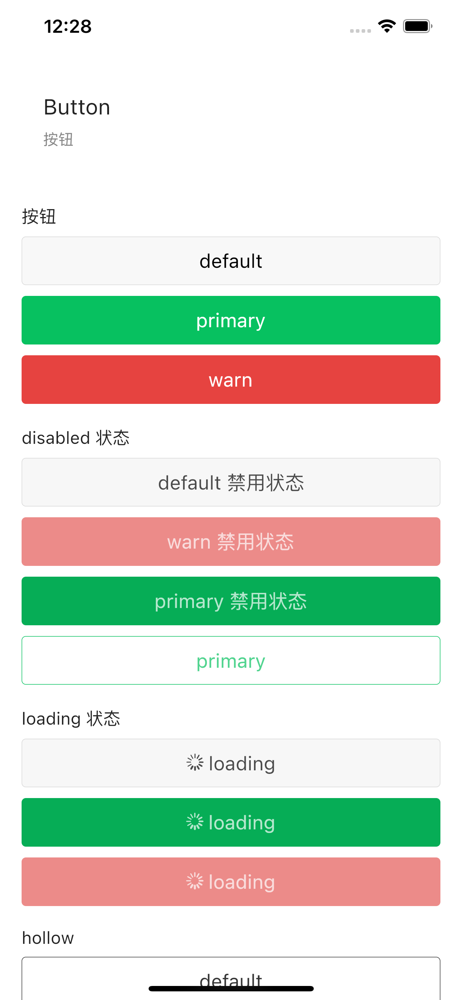
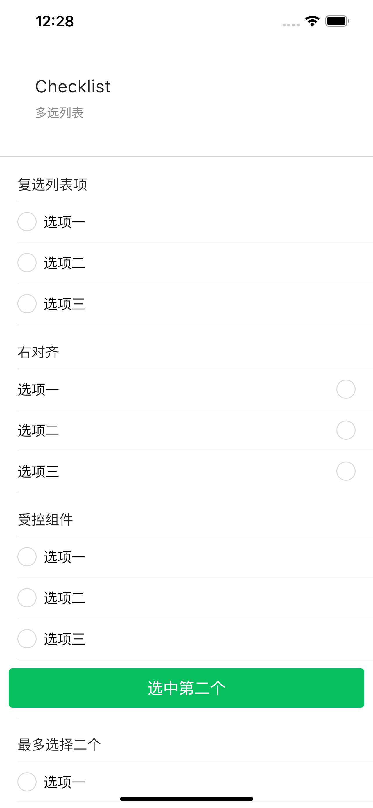
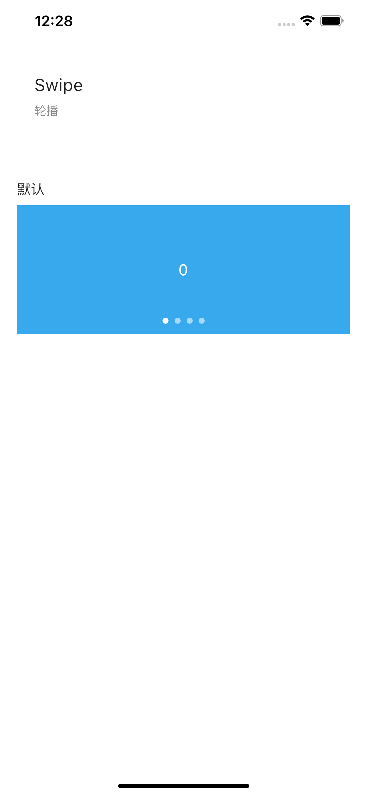
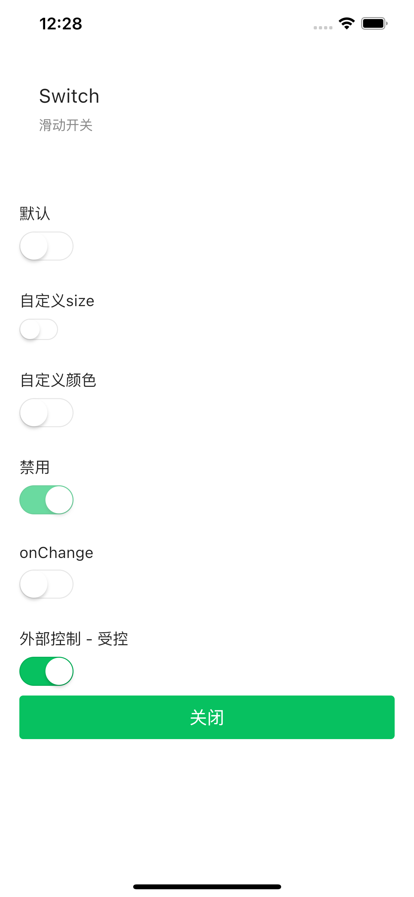
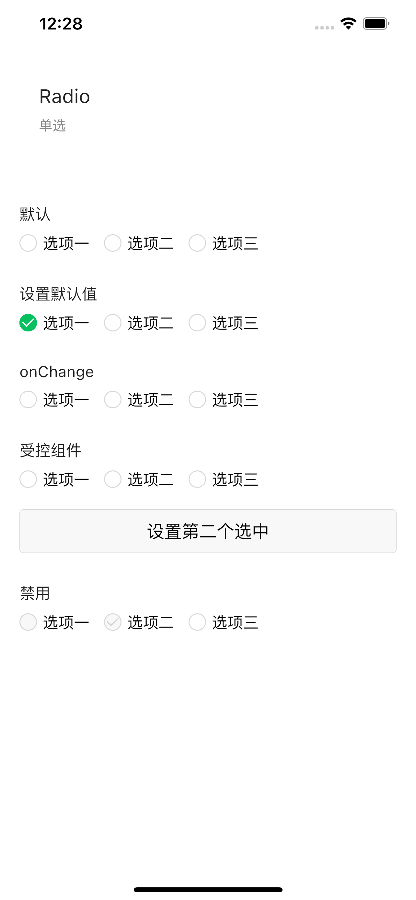

# tdui   [](http://tdui.td0f7.cn)

#### TdUi 是一套视觉体验一致的基础UI样式框架，由weui演变而来，由于weui不兼容2.0及以上flutter版本，特更新此ui框架。

## 测试下载
- ### Android
- ### iOS
- ### Windows
- ### Linux
- ### macOs
- ### Web

## 预览图







## 文档

http://tdui.td0f7.cn

## 安装
```
tdui: 0.0.2
```

## 如何运行案例
#### 1. clone 代码
```
git clone https://github.com/81024198/flutter-tdui-master.git
```

#### 2. 安装依赖
```
flutter packages get
```

#### 3. 进入example目录 执行以下命令
```
flutter run
```

